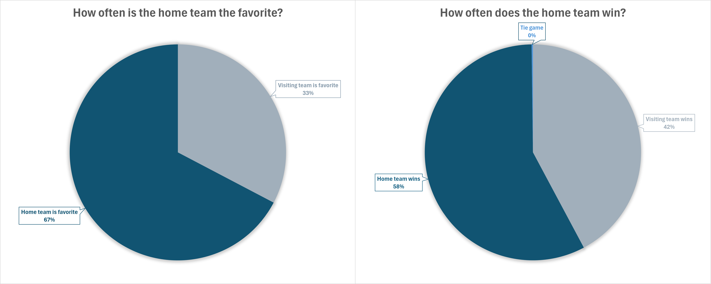

# NFL Scores and Betting Data

## Overview

An analysis of NFL game and betting data using a dataset found on Kaggle. The dataset contains game information starting from the 1966 season, all the way through the 2024-2025 season. Some of the data points it tracks are the scores of each game, the line of each game at kickoff, and the over/under of each game at kickoff.

For more information on the dataset, click [here](https://www.kaggle.com/datasets/tobycrabtree/nfl-scores-and-betting-data/data) to go to the posting on the Kaggle website.

### Questions

1. How often is the home team the favorite, and how often does the home team win the game?
2. How often does the spread favorite win the game? Also, does this change from week to week?
3. How often does the spread favorite cover? Does this change from week to week?
4. How often does a game's point total go over or under the over / under line, and does this change from week to week?

## Analysis

### 1. Home Team

- How often is the home team the favorite to win the game?
- How often does the home team actually win the game?
- Pick-em games, games without a line, and neutral site games were filtered out.

Queries: [1.0_home_team_favorite](Scripts/1.0_home_team_favorite.sql) and [1.1_home_team_wins_game](Scripts/1.1_home_team_wins_game.sql)

**Visualization:**

**Findings and Insights**

- The home team was favored to win the game 67% of the time.
- However, the home team ended up winning only 58% of the time.
- While being the home team does have it's advantages, such as having the crowd on your side and not having to travel, it doesn't seem to be as much of an advantage as bettors think it is.

### 2. Spread favorite winning the game

- How often does the spread favorite end up winning the game?
- Does the percentage of the spread favorite winning change over the course of the season?
- Filtered out games without lines and pick-em games.

The first query takes data from all of the games in the dataset (excluding games without lines and pick'em games) and calculates how often the spread favorite ended up winning the game.

Query: [2.0_spread_vs_game_winner](Scripts\2.0_spread_vs_game_winner.sql)

**Visualization:**

The second query also calculates how often the spread favorite won the game, but on a week-by-week basis (i.e. all week 1 games from every year in the dataset, all week 2 games from every year in the dataset, etc.).  

Query: [2.1_spread_vs_game_winner_week_be_week](images\2.1_spread_vs_game_winner_week_by_week.png)

**Visualization:**

**Findings and Insights**

- From the first visualization, we can see that the spread favorite won 66% of the games.
- From the second visualization, which calculates how often the spread favorite won on a week-by-week basis, we can see that the general trend of the spread favorite winning goes up slightly throughout the season.
- A possible reason for the spread favorite winning more often later in the season is that as the season goes on, bettors become more familiar with all of the teams, and are better able to predict how each team will perform.

### 3. Favorite covering the spread

- How often does the favorite cover the spread?
- Does the percentage of the favorite coving the spread change from week to week?
- Filtered out games without lines and games that were pick-em.

This first query explores how often the spread favorite covers the spread.

Query: [3.0_spread_fav_covers](Scripts\3.0_spread_fav_covers.sql)

**Visualization:**

The second query looks at how often the favorite covers the spread on a week-by-week basis.

Query: [3.1_cover_spread_week_by_week](Scripts\3.1_cover_spread_week_by_week.sql)

**Visualization:**

**Findings and Insights**

- Overall, the favorite covered the spread 47% of the time.
- When looking at how often the favorite covers the spread on a week-by-week basis, the trend of the favorite covering goes up slightly as we get deeper into the season.
- For most weeks, the favorite covered the spread less than 50% of the time, so that may be something to consider when placing wagers.

### 4. Over / Under week-by-week

- How often does a game's point total go over or under the over / under line?
- Does the percentage of games going over the over / under line change from week to week?
- Games without over / under lines were filtered out.

The first query looks at how often the game point total went over or under the over / under line.

Query: [4.0_overunder_overall](Scripts\4.0_overunder_overall.sql)

The second query looks at how often the game point total was over the over / under line on a week-by-week basis.

Query: [4.1_overunder_week_by_week](Scripts\4.1_overunder_week_by_week.sql)

**Findings and Insights**

- Overall, about 50% of games were under the over / under line, with 48% over, and 2% pushing.
- When looking at the week-by-week data, the number of games that have point totals go over the over / under line trends up slightly throughout the season. The reasons for this could be:
    - There is the belief that offenses take longer to get "up to speed" than defenses. If this is the case, this could contribute to more games going "under" early in the season.
    - Over the last few years, starters have been playing less during the pre-season. This could also contribute to offenses needing a few weeks in the regular season before they are in mid-season form.
    - During the beginning of the season, there will be optimism that new players added to offenses in the off-season will make them more productive, which could lead to over-estimating the over / under line.

## Conclusions

After looking at the data, here are some insights that bettors may be able to take advantage of.

- While the home team is usually the favorite in the game at 67% of the time, they don't win quite as often as they are favored, at 58%.
- The week-by-week data shows that changes do occur throughout the season.  For example:
    - In the early weeks of the season, the spread favorite wins the game a little under 66% of the time, but as the season goes on, the percentage of the spread favorite winning does continually trend upward to over 66%.
    - When looking at how often the spread favorite covers the spread, we can see that the spread favorite covers the spread more and more as the season goes along.
    - As for the over / under, we can see that the percentage of games that go over the over / under line slightly increase throughout the season.

## Tools Used
- **Database:** PostgreSQL
- **Analysis Tools:** PostgreSQL, DBeaver, VS Code
- **Visualizations:** Microsoft Excel